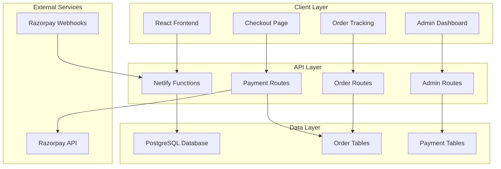
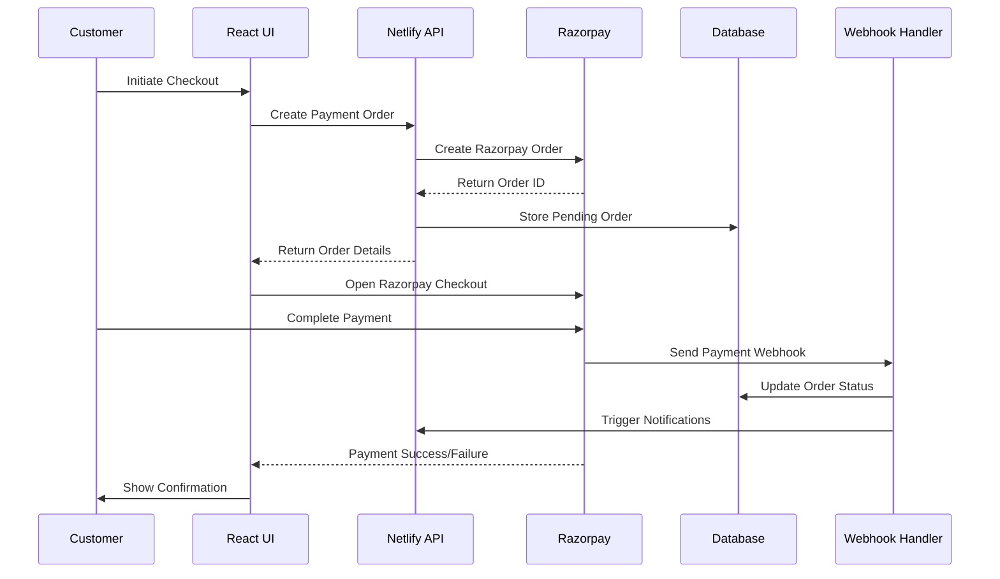

# Design Document

## Overview

This design document outlines the integration of Razorpay payment processing and comprehensive order management system into the existing Willowbrook Clothing platform. The solution leverages Razorpay's robust Indian payment infrastructure to provide seamless checkout experiences while implementing a complete order tracking and admin management system.

The design builds upon the existing serverless architecture using Netlify Functions, PostgreSQL database, and React frontend, ensuring minimal disruption to current functionality while adding enterprise-grade payment and order management capabilities.

## Architecture

### High-Level Architecture



### Payment Flow Architecture



## Components and Interfaces

### Frontend Components

#### 1. Payment Integration Components

**CheckoutPage Enhancement**
- Integrates Razorpay checkout widget
- Handles payment success/failure states
- Manages order creation and confirmation
- Provides real-time payment status updates

**PaymentForm Component**
```typescript
interface PaymentFormProps {
  orderTotal: number
  shippingInfo: ShippingInfo
  cartItems: CartItem[]
  onPaymentSuccess: (paymentData: PaymentSuccessData) => void
  onPaymentFailure: (error: PaymentError) => void
}
```

**OrderConfirmation Component**
- Displays order confirmation details
- Shows payment receipt information
- Provides order tracking link
- Handles email confirmation triggers

#### 2. Order Tracking Components

**OrderTrackingPage**
- Public order lookup by order number and email
- Real-time status updates
- Timeline visualization of order progress
- Estimated delivery information

**OrderStatusTimeline Component**
```typescript
interface OrderStatusTimelineProps {
  order: OrderWithTracking
  showEstimates: boolean
}
```

#### 3. Admin Dashboard Enhancements

**OrderManagement Enhancement**
- Comprehensive order listing with advanced filters
- Bulk order operations
- Payment status indicators
- Quick status update actions

**OrderDetailsModal Component**
- Complete order information display
- Payment transaction details
- Customer information
- Status update controls
- Refund management interface

**PaymentAnalytics Component**
- Revenue dashboards
- Payment method analytics
- Success rate metrics
- Settlement tracking

### Backend API Enhancements

#### 1. Payment Routes (`/api/payments`)

**POST /api/payments/create-order**
```typescript
interface CreatePaymentOrderRequest {
  cartItems: CartItem[]
  shippingInfo: ShippingInfo
  customerInfo: CustomerInfo
}

interface CreatePaymentOrderResponse {
  razorpayOrderId: string
  orderId: string
  amount: number
  currency: string
  keyId: string
}
```

**POST /api/payments/verify**
```typescript
interface VerifyPaymentRequest {
  razorpay_order_id: string
  razorpay_payment_id: string
  razorpay_signature: string
  orderId: string
}
```

**POST /api/payments/webhook**
- Handles Razorpay webhook events
- Verifies webhook signatures
- Updates order and payment status
- Triggers notification systems

#### 2. Enhanced Order Routes

**GET /api/orders/track/:orderNumber**
```typescript
interface OrderTrackingResponse {
  order: Order
  timeline: OrderStatusEvent[]
  estimatedDelivery: Date
  trackingUrl?: string
}
```

**PUT /api/orders/:id/status**
```typescript
interface UpdateOrderStatusRequest {
  status: OrderStatus
  notes?: string
  trackingCode?: string
  estimatedDelivery?: Date
}
```

#### 3. Admin Analytics Routes

**GET /api/admin/analytics/payments**
```typescript
interface PaymentAnalyticsResponse {
  totalRevenue: number
  successRate: number
  paymentMethods: PaymentMethodStats[]
  dailyRevenue: DailyRevenueData[]
  settlementSummary: SettlementData
}
```

## Data Models

### Enhanced Database Schema

#### Payment Transactions Table
```sql
CREATE TABLE payment_transactions (
  id VARCHAR(255) PRIMARY KEY,
  order_id VARCHAR(255) REFERENCES orders(id),
  razorpay_order_id VARCHAR(255) UNIQUE,
  razorpay_payment_id VARCHAR(255),
  razorpay_signature VARCHAR(500),
  amount DECIMAL(10,2) NOT NULL,
  currency VARCHAR(3) DEFAULT 'INR',
  status VARCHAR(50) DEFAULT 'PENDING',
  payment_method VARCHAR(100),
  payment_method_details JSONB,
  gateway_fee DECIMAL(10,2),
  net_amount DECIMAL(10,2),
  settled_at TIMESTAMP,
  created_at TIMESTAMP DEFAULT CURRENT_TIMESTAMP,
  updated_at TIMESTAMP DEFAULT CURRENT_TIMESTAMP
);
```

#### Order Status History Table
```sql
CREATE TABLE order_status_history (
  id VARCHAR(255) PRIMARY KEY,
  order_id VARCHAR(255) REFERENCES orders(id),
  status VARCHAR(50) NOT NULL,
  notes TEXT,
  changed_by VARCHAR(255) REFERENCES users(id),
  created_at TIMESTAMP DEFAULT CURRENT_TIMESTAMP
);
```

#### Enhanced Orders Table
```sql
ALTER TABLE orders ADD COLUMN IF NOT EXISTS payment_status VARCHAR(50) DEFAULT 'PENDING';
ALTER TABLE orders ADD COLUMN IF NOT EXISTS estimated_delivery TIMESTAMP;
ALTER TABLE orders ADD COLUMN IF NOT EXISTS order_number VARCHAR(50) UNIQUE;
ALTER TABLE orders ADD COLUMN IF NOT EXISTS customer_notes TEXT;
```

### TypeScript Interfaces

#### Payment Models
```typescript
interface PaymentTransaction {
  id: string
  orderId: string
  razorpayOrderId: string
  razorpayPaymentId?: string
  razorpaySignature?: string
  amount: number
  currency: string
  status: 'PENDING' | 'PAID' | 'FAILED' | 'REFUNDED'
  paymentMethod?: string
  paymentMethodDetails?: any
  gatewayFee?: number
  netAmount?: number
  settledAt?: Date
  createdAt: Date
  updatedAt: Date
}
```

#### Enhanced Order Models
```typescript
interface OrderWithPayment extends Order {
  orderNumber: string
  paymentStatus: 'PENDING' | 'PAID' | 'FAILED' | 'REFUNDED'
  estimatedDelivery?: Date
  customerNotes?: string
  paymentTransaction?: PaymentTransaction
  statusHistory: OrderStatusEvent[]
}

interface OrderStatusEvent {
  id: string
  orderId: string
  status: OrderStatus
  notes?: string
  changedBy: string
  createdAt: Date
}
```

## Error Handling

### Payment Error Scenarios

#### 1. Payment Gateway Errors
```typescript
interface PaymentError {
  code: string
  description: string
  source: 'razorpay' | 'network' | 'validation'
  step: 'order_creation' | 'payment_processing' | 'verification'
  retryable: boolean
}
```

**Error Handling Strategy:**
- Network failures: Automatic retry with exponential backoff
- Payment failures: Clear user messaging with retry options
- Validation errors: Immediate feedback with correction guidance
- Gateway errors: Fallback to alternative payment methods

#### 2. Order Processing Errors
- Inventory validation failures
- Price calculation mismatches
- Database transaction failures
- Webhook processing errors

#### 3. Admin Operation Errors
- Unauthorized status changes
- Invalid order modifications
- Bulk operation failures
- Report generation errors

### Error Recovery Mechanisms

#### 1. Payment Recovery
```typescript
interface PaymentRecoveryService {
  retryFailedPayment(orderId: string): Promise<PaymentResult>
  reconcilePaymentStatus(razorpayOrderId: string): Promise<void>
  handleWebhookFailure(webhookData: any): Promise<void>
}
```

#### 2. Order State Recovery
- Automatic order status synchronization
- Manual admin intervention tools
- Customer self-service recovery options
- Audit trail maintenance

## Testing Strategy

### Unit Testing

#### 1. Payment Service Tests
```typescript
describe('PaymentService', () => {
  test('should create Razorpay order successfully')
  test('should verify payment signature correctly')
  test('should handle payment failures gracefully')
  test('should process webhooks securely')
})
```

#### 2. Order Management Tests
```typescript
describe('OrderService', () => {
  test('should create order with payment integration')
  test('should update order status with history tracking')
  test('should calculate totals including taxes and fees')
  test('should handle concurrent order updates')
})
```

### Integration Testing

#### 1. Payment Flow Tests
- End-to-end checkout process
- Payment success and failure scenarios
- Webhook processing validation
- Order status synchronization

#### 2. Admin Workflow Tests
- Order management operations
- Bulk status updates
- Analytics data accuracy
- Permission-based access control

### Security Testing

#### 1. Payment Security
- Webhook signature verification
- Payment data encryption
- PCI compliance validation
- Fraud detection integration

#### 2. Admin Security
- Role-based access control
- Audit logging verification
- Data privacy compliance
- API rate limiting

### Performance Testing

#### 1. Payment Performance
- Checkout page load times
- Payment processing latency
- Webhook processing speed
- Database query optimization

#### 2. Admin Performance
- Order listing pagination
- Analytics query performance
- Bulk operation efficiency
- Real-time update responsiveness

## Security Considerations

### Payment Security

#### 1. PCI Compliance
- No sensitive card data storage
- Razorpay handles all payment processing
- Secure token-based communication
- Regular security audits

#### 2. Webhook Security
```typescript
interface WebhookValidator {
  verifySignature(payload: string, signature: string): boolean
  validateEventType(event: RazorpayEvent): boolean
  checkReplayAttack(eventId: string): boolean
}
```

### Data Protection

#### 1. Customer Data
- Encrypted storage of sensitive information
- GDPR compliance for data handling
- Secure data transmission (HTTPS)
- Regular data backup and recovery

#### 2. Admin Access Control
- Multi-factor authentication
- Role-based permissions
- Session management
- Activity logging and monitoring

### API Security

#### 1. Authentication & Authorization
- JWT token validation
- API rate limiting
- Request validation and sanitization
- CORS policy enforcement

#### 2. Data Validation
```typescript
interface PaymentValidation {
  validateOrderAmount(amount: number): ValidationResult
  validateShippingInfo(info: ShippingInfo): ValidationResult
  validatePaymentSignature(signature: string): ValidationResult
}
```

## Performance Optimization

### Frontend Optimization

#### 1. Payment UI Performance
- Lazy loading of Razorpay SDK
- Optimized checkout form rendering
- Efficient state management
- Progressive loading indicators

#### 2. Admin Dashboard Performance
- Virtual scrolling for large order lists
- Debounced search and filtering
- Cached analytics data
- Optimistic UI updates

### Backend Optimization

#### 1. Database Performance
```sql
-- Optimized indexes for payment queries
CREATE INDEX idx_orders_payment_status ON orders(payment_status, created_at);
CREATE INDEX idx_payment_transactions_status ON payment_transactions(status, created_at);
CREATE INDEX idx_order_status_history_order_id ON order_status_history(order_id, created_at);
```

#### 2. API Performance
- Connection pooling optimization
- Query result caching
- Webhook processing queues
- Batch operations for bulk updates

### Monitoring and Analytics

#### 1. Payment Monitoring
```typescript
interface PaymentMetrics {
  successRate: number
  averageProcessingTime: number
  failureReasons: FailureAnalysis[]
  revenueMetrics: RevenueData
}
```

#### 2. System Health Monitoring
- API response times
- Database query performance
- Error rates and patterns
- User experience metrics

This design provides a comprehensive foundation for implementing secure, scalable payment processing and order management while maintaining the existing architecture's strengths and ensuring optimal performance for Indian market requirements.